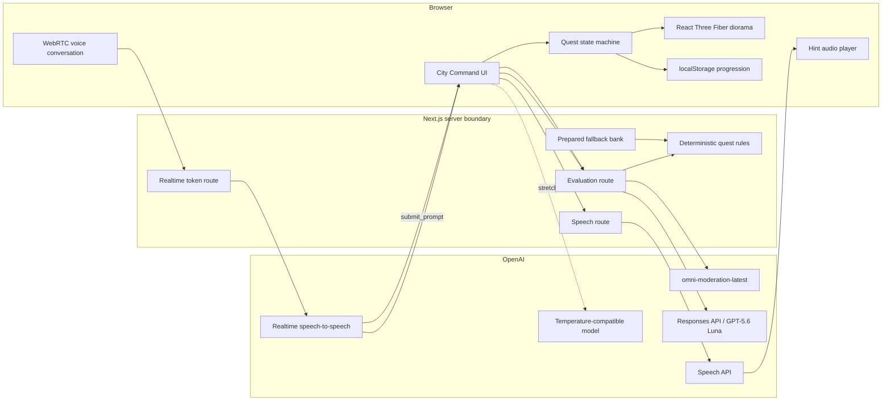

# Architecture

## Shape

One Next.js TypeScript application delivers City Command UI, Three.js diorama, API routes, deterministic quest rules, and public Codex Sites deployment. No database or player authentication.



## Component boundaries

### City Command

Owns screen layout, Project Brief, prompt editor, microphone controls, citizen dialogue, checklist, loading/error states, and celebration. It consumes Turn Results and never parses raw model prose.

### Quest engine

Pure deterministic module. Given current quest state plus validated extracted traits, returns repair delta, passed needs, next stage, celebration flag, and one hint key. This is primary testing seam.

### Diorama

Fixed isometric React Three Fiber scene built from procedural rounded geometry. Named mesh groups represent broken and repaired states for accessible entrance, civic sign, and weather cover. Diorama accepts state; it never owns progression.

### Evaluation route

Validates length and shape, runs moderation, calls Responses API with strict Structured Outputs, validates response again, invokes quest engine, and returns Turn Result. On invalid/failed model output, selects prepared fallback matching current stage.

### Realtime token route

Validates mission, step, explicit language, progress, and privacy-preserving safety identifier. Uses server-side project API key to mint short-lived `type: realtime` client credential. Browser connects over WebRTC for speech-to-speech coaching. Realtime tool `submit_prompt` asks browser to relay candidate text to Evaluation route; voice never owns progression.

### Speech route

Accepts only approved hint keys or bounded hint text produced by server. Returns generated audio. Failure leaves text feedback intact.

## Data contracts

Decision-rich contract:

```ts
type PromptExtraction = {
  offTopic: boolean;
  promptBlueprint: {
    goal: boolean;
    context: boolean;
    constraints: boolean;
    output: boolean;
  };
  civicTraits: {
    accessibleEntrance: boolean;
    clearSign: boolean;
    weatherCover: boolean;
  };
  evidence: string[];
  citizenLine: string;
  nextHint: string;
};

type TurnResult = {
  source: "live" | "fallback";
  offTopic: boolean;
  repairDelta: string[];
  passedNeeds: string[];
  nextStage: "ready" | "partial" | "restored";
  citizenLine: string;
  nextHint: string;
};
```

Responses schema requires every property and rejects additional properties. Server trims evidence and dialogue to bounded lengths before returning data.

## Model choices

| Purpose | Choice | Reason |
|---|---|---|
| Prompt extraction | `gpt-5.6-luna`, low reasoning | Fast, low-cost structured turns |
| Voice conversation | `OPENAI_REALTIME_MODEL` or `gpt-realtime` over WebRTC | Natural low-latency audio and function calling |
| Input transcription | `gpt-4o-mini-transcribe` inside Realtime session | Bilingual transcript context for tool submission |
| Standalone voice hints | `gpt-4o-mini-tts` | Fallback generated speech |
| Harmful-input filter | `omni-moderation-latest` | Current capable free moderation model |
| Parameter Trial | GPT-5.2 with reasoning disabled, compatibility checked at preflight | Documented temperature support; isolated stretch scope |

Parameter Trial uses temperatures `0.2`, `0.7`, and `1.2`. Only one sampling control changes; `top_p` remains default.

## Game state

Current learning journey exposes housing, hospital, and urban-repair missions independently. `completedMissionIds` is a unique set serialized in canonical registry order; `activeMissionId` is a freely chosen display focus. Recommendation selects first incomplete mission but never gates access. Only `/api/evaluate` success plus installation-bound signed completion-set receipt may add completion. Local storage cannot authorize city effects or NPC improvement.

Browser reducer stores:

- current narrative beat;
- discovered Citizen Requests;
- passed Town Hall needs;
- selected mission path returned by evaluator;
- attempt count and help tier;
- voice preference;
- random anonymous safety identifier;
- core completion and Parameter Trial unlock.

Persist progression, preferences, and random anonymous safety identifier only. Never persist raw prompts, transcripts, moderation results, or audio.

## Safety and privacy

- Public prototype marked 18+.
- Server-side project API key; never serialize it into client bundle.
- 600-character prompt limit.
- Moderate before evaluation.
- Flagged or off-topic input returns Playful Redirect and no City change.
- Generated speech never echoes raw harmful input.
- Generate a random privacy-preserving installation identifier, store it locally, and send it as stable `safety_identifier` for model requests.
- No accounts, analytics, cookies beyond deployment essentials, or server persistence.
- Generated voice disclosure visible beside audio control.
- Realtime credential request sets `OpenAI-Safety-Identifier` on server; browser receives only ephemeral secret.
- Realtime prose and tool arguments are non-authoritative. Only `/api/evaluate` result changes city state.

## Performance

- Fixed camera; no orbit, pan, or avatar movement.
- Procedural geometry only; no model-loader pipeline.
- Cap device pixel ratio at 1.5.
- Disable optional shadows and particles on low-performance devices.
- Honor reduced-motion preference.
- Narrow screens receive landscape/larger-screen notice.

## Error behavior

| Failure | Behavior |
|---|---|
| Moderation unavailable | Do not send prompt onward; offer retry |
| Responses timeout or invalid schema | Prepared stage-appropriate Turn Result; subtle offline badge |
| Realtime denied or fails | Keep typed prompt fully available |
| Speech fails | Render text hint; no blocked progression |
| WebGL weak | Lower DPR, shadows, and particles; preserve quest state |
| localStorage unavailable | Continue session without persistence |

## Deployment

Codex Sites is required public target. First implementation checkpoint must prove:

1. public HTTPS URL;
2. protected server secret;
3. working server route;
4. WebRTC microphone permission;
5. fallback path.

If Sites cannot protect server credentials or execute required server route, live deployment is blocked. Never move project API key into browser to bypass platform limitation.
