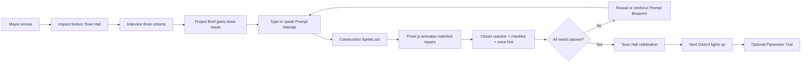
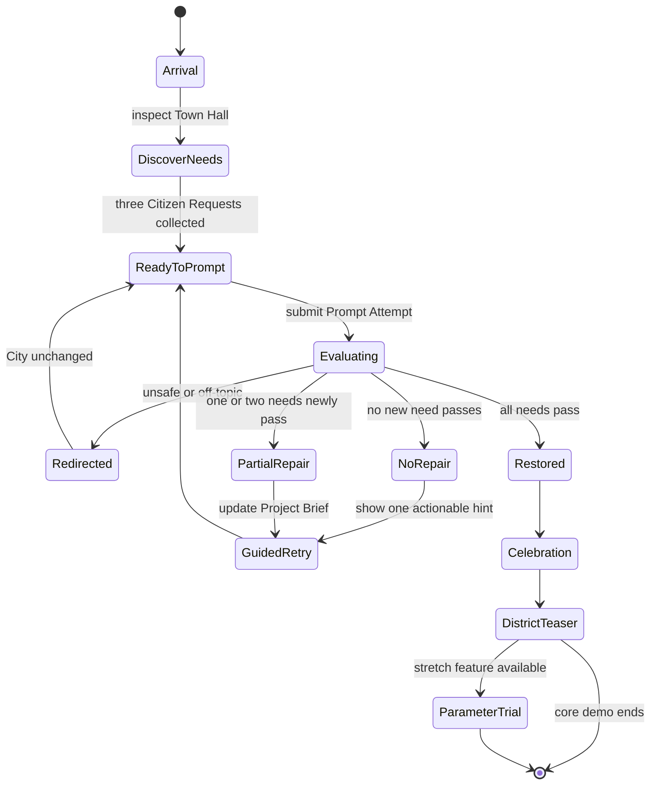
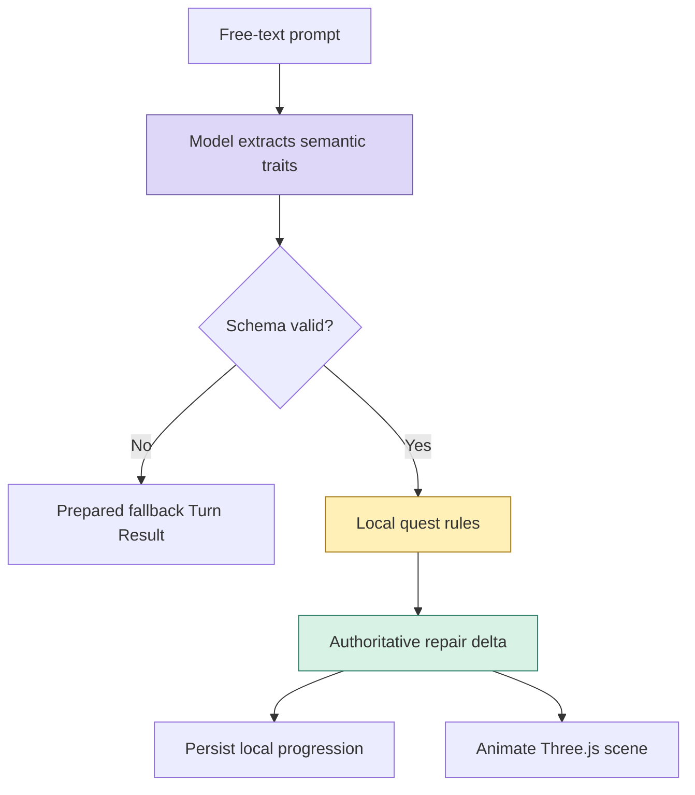
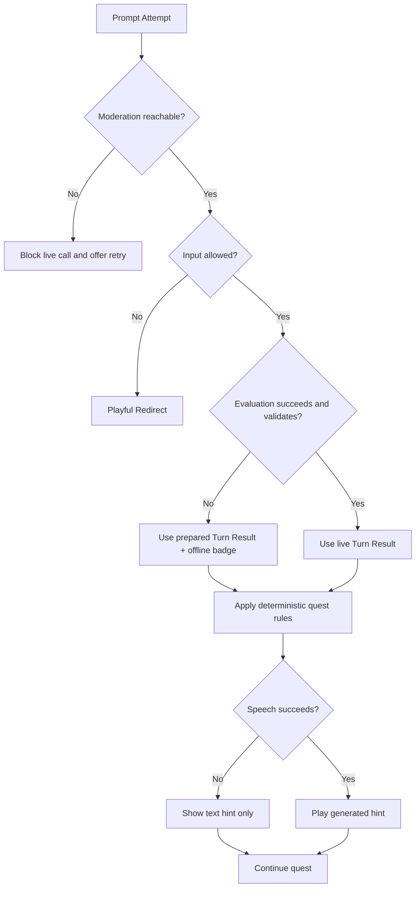
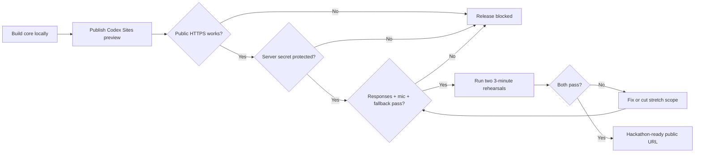

# Product and System Flows

## Player journey



## Prompt Attempt sequence

```mermaid
sequenceDiagram
    autonumber
    actor Player
    participant UI as City Command UI
    participant Moderation as Moderation API
    participant Route as Evaluation Route
    participant Responses as Responses API
    participant Rules as Quest Rules
    participant Scene as Three.js Diorama
    participant SpeechRoute as Speech Route
    participant Speech as Speech API

    Player->>UI: Submit typed or transcribed prompt
    UI->>Route: prompt, quest ID, current stage
    Route->>Moderation: classify prompt
    alt Flagged input
        Moderation-->>Route: flagged
        Route-->>UI: Playful Redirect
        UI-->>Player: Safe redirect; City unchanged
    else Allowed input
        Moderation-->>Route: allowed
        Route->>Responses: extract Prompt Blueprint and civic traits
        Responses-->>Route: strict structured result
        Route->>Rules: compare traits with Project Brief
        Rules-->>Route: repair delta, checklist, next hint
        Route-->>UI: validated Turn Result
        UI->>Scene: animate repair delta
        UI->>SpeechRoute: request approved hint audio
        SpeechRoute->>Speech: generate bounded hint
        Speech-->>SpeechRoute: audio
        SpeechRoute-->>UI: audio
        par Visual feedback
            Scene-->>Player: repair or comic error animation
        and Audio feedback
            UI-->>Player: generated citizen hint
        end
    end
```

## Quest state machine



## Evaluation ownership



Model interprets language. Local rules decide game progression. Scene only renders approved state changes.

## Failure and fallback flow



## Public release flow


