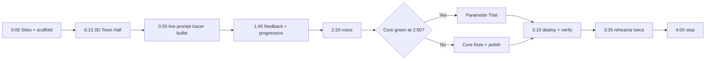

# Four-Hour Hackathon Workflow

## Operating principle

Protect one end-to-end tracer bullet: Player submits typed prompt, OpenAI returns validated traits, quest engine decides repair, and Town Hall visibly changes. Every other feature attaches after this loop passes.

Configured Codex 1.5× speed mode may reduce latency, but plan assumes no time bonus.

## Pre-timer checklist

Complete before four-hour coding window:

- OpenAI project API key funded and available as secret.
- Codex Sites access confirmed.
- Browser microphone permission understood.
- Repository cloned on `main` with clean worktree.
- Proposal, glossary, and ADRs reviewed.
- Three fixed demo prompts prepared: vague, partial, complete.

No production assets are required; scene uses procedural Three.js geometry.

## Timebox

| Time | Outcome | Kill condition |
|---|---|---|
| 0:00–0:15 | Scaffold Next.js, create public Sites preview, prove server secret/API route | Stop and solve deployment boundary before feature work |
| 0:15–0:55 | Fixed-camera procedural Town Hall with broken/repaired mesh groups | Cut decorative City geometry before core meshes |
| 0:55–1:45 | Prompt editor, evaluation route, strict schema, quest engine, fallback bank | Use fallback-only integration until live schema stabilizes |
| 1:45–2:20 | Project Brief, citizen feedback, repair tweens, Prompt Blueprint | Cut nonessential particles and secondary dialogue |
| 2:20–2:50 | Realtime transcription and generated voice hint | Text path remains complete if voice misses deadline |
| 2:50–3:10 | Parameter Trial or final visual polish | Build Parameter Trial only when core and voice are green |
| 3:10–3:35 | Public Sites release, fixed prompt fixtures, browser smoke paths | Cut stretch scope immediately on deployment failure |
| 3:35–4:00 | Two three-minute rehearsals, bug fixes, reset state | No new features |

## Codex orchestration

Use root agent as integrator and decision owner. Parallel work gets strict file/module ownership:

| Lane | Responsibility | Must not edit |
|---|---|---|
| 3D builder | Diorama geometry, camera, repair mesh groups, animation API | API routes, quest rules |
| AI builder | Evaluation schema, moderation, Responses, Realtime token, Speech, fallback bank | Three.js scene |
| Product builder | Quest reducer, City Command UI, Project Brief, feedback, persistence | OpenAI prompts, scene internals |
| Root integrator | Scaffold, public interfaces, tests, conflict prevention, Sites release, demo rehearsal | Delegates bounded modules, owns final integration |

Agents share decisions through domain terms from `CONTEXT.md`. Root agent defines interfaces before parallel work starts. No two agents edit same file concurrently.

## Checkpoints

### Checkpoint 1 — deployment proof, minute 15

- Public Sites preview resolves.
- Server route can read protected secret.
- Browser never receives secret.

### Checkpoint 2 — tracer bullet, minute 105

- One typed prompt travels through moderation and Responses.
- Strict result validates.
- Quest engine returns repair delta.
- Scene animates corresponding repair.
- Fallback produces same external contract.

### Checkpoint 3 — core feature freeze, minute 170

- Town Hall can complete.
- Prompt Blueprint teaches Goal, Context, Constraints, Output.
- Typed path needs no voice.
- Reset works.

### Checkpoint 4 — release candidate, minute 215

- Public URL passes core and fallback browser paths.
- Voice either works or is disabled cleanly.
- Fixed prompt fixtures pass.
- Parameter Trial exists only if earlier gates passed.

## Feature kill order

Cut from bottom upward:

1. decorative particles and camera flourishes;
2. extra citizen dialogue;
3. Parameter Trial;
4. generated voice output;
5. Realtime transcription;
6. never cut typed core Prompt Quest, deterministic fallback, or Town Hall completion.

## Verification commands

Exact package scripts will be established during scaffold. Required categories:

- format/lint;
- TypeScript compile;
- quest-engine and contract tests;
- fixed prompt fixture runner;
- production build;
- Playwright core and fallback smoke tests.

Run complete verification before Sites publish and again against public URL.

## Demo operating procedure

1. Reset local progression.
2. Confirm live/fallback indicator says live.
3. Test microphone once; keep typed prompts copied nearby.
4. Run guided three-minute sequence.
5. If API fails, allow fallback and disclose it briefly.
6. Show architecture diagram after celebration: OpenAI interprets, local rules decide, Three.js performs.
